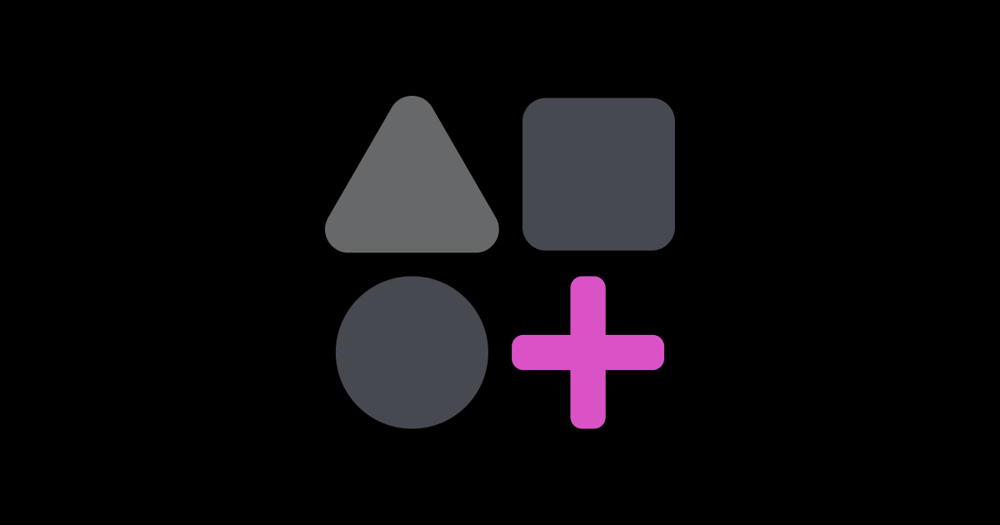

# 🌟 Crypto Personality Quiz - Base Mini App

A fun, interactive quiz that helps users discover their crypto personality! Built with Next.js, Base MiniKit, and includes onchain functionality for storing quiz results and minting personality NFTs.



## ✨ Features

- 🎯 **Interactive Quiz**: 5 engaging questions with personality-based scoring
- 🎨 **Beautiful UI**: Cute, modern design with smooth animations
- 💼 **Wallet Integration**: Auto-connects with Base MiniKit
- ⛓️ **Onchain Results**: Store quiz results permanently on Base blockchain
- 🖼️ **NFT Minting**: Mint unique personality NFTs based on results
- 📊 **Score Breakdown**: Visual representation of personality traits
- 📱 **Mobile Responsive**: Works perfectly on all devices

## 🪙 Personality Types

### Bitcoin: The Pioneer ₿
Steady, reliable, and built to last. You're the foundation everyone builds upon.

### Ethereum: The Builder ⟠
Innovative and collaborative. You're versatile, creative, and always pushing boundaries.

### Solana: The Speedster ◎
Fast, bold, and ahead of the curve. Built for speed and efficiency.

### Dogecoin: The Social Butterfly Ð
Fun, friendly, and community-driven. You bring joy wherever you go!

## 🚀 Quick Start

### Prerequisites

- Node.js 18+ installed
- Base app account
- [Farcaster](https://farcaster.xyz/) account
- [Coinbase Developer Platform](https://portal.cdp.coinbase.com/) API Key

### Installation

```bash
# Install dependencies
npm install

# Create .env file
cp .env.example .env

# Add your API keys to .env
# NEXT_PUBLIC_ONCHAINKIT_API_KEY=your_key_here

# Run development server
npm run dev
```

Visit `http://localhost:3000` to see the app!

## 🎮 How It Works

### Quiz Flow

1. **Welcome Screen**: User sees welcome message with wallet info (auto-connected via MiniKit)
2. **Quiz Questions**: 5 questions with 4 options each
3. **Scoring System**: Each answer adds +1 to a personality type (Bitcoin, Ethereum, Solana, Dogecoin)
4. **Results**: Displays personality based on highest score with breakdown
5. **Actions**: Option to retake quiz or mint NFT

### Scoring Example

If a user answers:
- Question 1: A → +1 Bitcoin
- Question 2: C → +1 Ethereum  
- Question 3: B → +1 Solana
- Question 4: D → +1 Dogecoin
- Question 5: A → +1 Bitcoin

**Final Scores:**
- Bitcoin: 2 ⭐ **Winner!**
- Ethereum: 1
- Solana: 1
- Dogecoin: 1

**Result:** "You are Bitcoin: The Pioneer"

## ⛓️ Smart Contract Integration

### Contract Features

The `CryptoPersonalityQuiz.sol` contract provides:

- ✅ Store quiz results onchain with full score breakdown
- ✅ Mint personality NFTs (ERC-721)
- ✅ Retrieve user quiz history
- ✅ Track NFT ownership by personality type
- ✅ Event emissions for analytics

### Deploying the Contract

See [DEPLOYMENT_GUIDE.md](./DEPLOYMENT_GUIDE.md) for detailed instructions.

Quick deploy:

```bash
# Install Hardhat
npm install --save-dev hardhat @nomicfoundation/hardhat-toolbox

# Deploy to Base Sepolia testnet
npx hardhat run scripts/deploy.ts --network baseSepolia

# Update contract address in lib/contractConfig.ts
```

### Enabling Onchain Features

After deploying your contract:

1. Update `lib/contractConfig.ts` with your contract address
2. Upload NFT metadata to IPFS (see `nft-metadata/README.md`)
3. Uncomment contract integration in `app/page.tsx`:

```typescript
// Uncomment these lines:
import { useQuizContract } from "../lib/useQuizContract";
const { storeQuizResult, mintPersonalityNFT } = useQuizContract();
```

## 🎨 NFT Metadata

The project includes:
- 📄 Pre-configured JSON metadata for each personality
- 🖼️ SVG placeholder images in `/public`
- 📚 Comprehensive guide in `nft-metadata/README.md`

Upload your images and metadata to IPFS using [Pinata](https://pinata.cloud) or [NFT.Storage](https://nft.storage).

## 🏗️ Project Structure

```
mini-base-app-personality/
├── app/
│   ├── page.tsx              # Main quiz component
│   ├── page.module.css       # Cute styling
│   ├── layout.tsx            # App layout
│   └── rootProvider.tsx      # OnchainKit provider
├── contracts/
│   └── CryptoPersonalityQuiz.sol  # Smart contract
├── lib/
│   ├── contractConfig.ts     # Contract ABI & config
│   └── useQuizContract.ts    # React hooks for contract
├── nft-metadata/
│   ├── bitcoin.json          # NFT metadata files
│   ├── ethereum.json
│   ├── solana.json
│   ├── dogecoin.json
│   └── README.md
├── public/
│   ├── nft-bitcoin.svg       # Placeholder NFT images
│   ├── nft-ethereum.svg
│   ├── nft-solana.svg
│   └── nft-dogecoin.svg
└── DEPLOYMENT_GUIDE.md       # Detailed deployment instructions
```

## 🎯 Customization

### Modify Questions

Edit the `questions` array in `app/page.tsx`:

```typescript
const questions: Question[] = [
  {
    id: 1,
    question: "Your question here?",
    options: [
      { text: "Option A", personality: "Bitcoin" },
      { text: "Option B", personality: "Ethereum" },
      // ...
    ],
  },
  // Add more questions
];
```

### Update Styling

Modify colors and gradients in `app/page.module.css`:

```css
.container {
  background: linear-gradient(135deg, #your-colors);
}
```

### Add New Personalities

1. Add to `Personality` type in `page.tsx`
2. Add personality result data
3. Update smart contract enum
4. Create NFT metadata

## 📱 Deployment to Base App

### 1. Deploy to Vercel

```bash
vercel --prod
```

### 2. Update Environment Variables

```bash
vercel env add NEXT_PUBLIC_ONCHAINKIT_API_KEY production
vercel env add NEXT_PUBLIC_URL production
```

### 3. Configure Manifest

Update `minikit.config.ts` with your app details.

### 4. Sign Manifest

1. Go to [Farcaster Manifest tool](https://farcaster.xyz/~/developers/mini-apps/manifest)
2. Generate account association
3. Update `minikit.config.ts` with the signature

### 5. Publish

Post your app URL in the Base app to publish!

## 🧪 Testing

### Run Development Server

```bash
npm run dev
```

### Test Contract Locally

```bash
npx hardhat test
```

### Preview in Base App

Go to [base.dev/preview](https://base.dev/preview) and test your app URL.

## 💰 Cost Estimates

- Contract deployment: ~0.001-0.005 ETH
- Storing quiz result: ~0.0001-0.0003 ETH per submission
- Minting NFT: ~0.0002-0.0005 ETH per mint

Test on Base Sepolia testnet first (free testnet ETH)!

## 🔧 Tech Stack

- **Frontend**: Next.js 15, React 19, TypeScript
- **Styling**: CSS Modules with custom animations
- **Blockchain**: Base (Layer 2), Solidity
- **Web3**: wagmi, viem, OnchainKit
- **MiniApp**: Farcaster MiniKit SDK
- **Smart Contracts**: Hardhat, OpenZeppelin
- **NFT Storage**: IPFS (Pinata/NFT.Storage)

## 📚 Resources

- [Base Documentation](https://docs.base.org/)
- [OnchainKit Docs](https://onchainkit.xyz/)
- [MiniKit SDK](https://docs.farcaster.xyz/minikit)
- [Hardhat Docs](https://hardhat.org/)
- [OpenZeppelin](https://docs.openzeppelin.com/)
- [IPFS Documentation](https://docs.ipfs.tech/)

## 🤝 Contributing

Contributions welcome! Feel free to:
- Add new personality types
- Improve questions
- Enhance UI/UX
- Add features
- Fix bugs

## 📄 License

MIT License - feel free to use this project for your own crypto apps!

## 🎉 Credits

Built with ❤️ using Base, OnchainKit, and MiniKit.

Special thanks to:
- Base team for the amazing infrastructure
- Coinbase for OnchainKit
- Farcaster for MiniKit SDK
- OpenZeppelin for secure smart contracts

---

## 🚀 Ready to Deploy?

Check out the [DEPLOYMENT_GUIDE.md](./DEPLOYMENT_GUIDE.md) for step-by-step instructions!

**Happy quizzing! May the blockchain be with you! 🌟**
